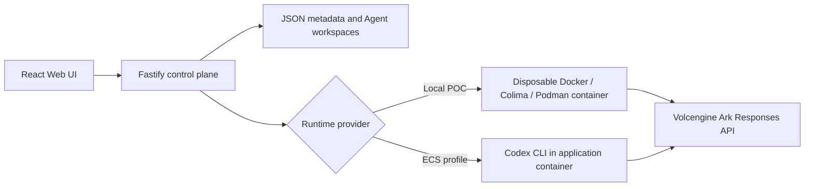

# Volc Agent Launchpad

A minimal Agent platform for three-day middleware hackathons. It provides Agent
CRUD, a browser Playground, persistent workspaces, and Codex CLI backed by the
Volcengine Ark Responses API.

Run it locally with Docker, Colima, or rootless Podman, or deploy it to
Volcengine ECS.

> [!WARNING]
> This is a single-user proof of concept. It has per-Agent tokens, scoped
> authorization, revocation, and correlated trace/audit spans (see "The
> Problem" below) — but no real human login, RBAC, multi-tenant isolation, or
> hardened sandbox beyond the Starter Kit's default container limits. Do not
> use production data or credentials. See [SECURITY.md](SECURITY.md).

## The Problem

The Starter Kit above ships with one shared credential — every Agent uses the platform's demo bearer token. That means any Agent can reach any resource: if
one Agent is tricked (for example, by a prompt-injected instruction hidden in a file it reads), there is nothing stopping it from touching data that isn't
its own.

This build closes that gap. Each Agent gets its own token, scoped to only the resources its owner granted. A single enforcement point checks every resource
request against that scope — regardless of what the Agent itself believes it should be allowed to do. 

## Screenshots

### Agent Playground


### Create an Agent


## Features

- React and TypeScript Web UI
- Agent create, edit, start, stop, delete, and multi-turn chat
- Fastify control plane with asynchronous Run state
- Persistent Agent workspaces and Codex sessions
- Disposable Docker, Colima, or Podman container for each local turn
- Docker and Terraform deployment paths for Volcengine ECS

## Requirements

- Node.js 22+
- npm 10+
- Docker, Colima, or Podman
- A Volcengine Ark API key and endpoint that supports the Responses API

Codex CLI is included in the Runtime image and is not required on the host.

## Local browser SOP

### 1. Check the local tools

Install Node.js 22+ and one supported container engine, then verify them:

```bash
node --version
npm --version
docker --version        # Docker Desktop, Docker Engine, or Colima
podman --version        # Use this instead when running Podman
```

Only one container engine is required. Codex CLI is already included in the
Runtime image.

### 2. Clone the repository

```bash
git clone <repository-url> volc-agent-launchpad
cd volc-agent-launchpad
```

Skip this step when already working from the repository root.

### 3. Start the mock resource service

The Agent-scoped-access demo (Task 2 below) needs a protected resource to
fetch from. In a separate terminal:

```bash
./scripts/start-mock-service.sh
```

First run creates a venv and installs dependencies. Leave it running — Beat 1
of the demo returns `502 Resource service unreachable` without it.

### 4. Start the POC

```bash
ARK_API_KEY=your-ark-api-key \
ARK_MODEL=ep-your-endpoint-id \
npm run poc
```

The first run installs Node.js dependencies and builds the Runtime image. The
script automatically selects Docker, Colima, or Podman, generates a control
plane access token, and prints it — **copy that token**, you'll need it in
the next step. It also warns if the mock service from step 3 isn't running.

**For a live demo or recording**, don't rely on the auto-generated token — a
browser refresh loses it (it lives in memory, not storage, deliberately —
see Security), and every restart generates a new one. Export a stable,
obviously-fake value yourself before starting:

```bash
export APP_AUTH_TOKEN=demo-operator-token-not-a-real-secret
npm run poc
```

It's safe to show on screen: the name says what it is, and it isn't derived
from or connected to any real credential.

### 5. Open the browser

Visit <http://localhost:3000>, or open it from the terminal:

```bash
open http://localhost:3000       # macOS
xdg-open http://localhost:3000   # Linux desktop
```

Paste the access token printed in step 4 into the unlock screen — this is
the human operator's credential, separate from any Agent's own token. In the
Web UI:

1. Select **Create Agent**.
2. Enter a name, description, and workspace instructions.
3. Select **Create Agent** again.
4. Enter a task in the Playground, for example:

   ```text
   Create a TypeScript hello-world CLI, add a test, and run it.
   ```

The Agent can write files, run commands, and continue the same Codex session in
later messages.

### 6. Stop and resume

Press `Ctrl+C` in the startup terminal. The script removes temporary Runtime
containers but keeps Agent workspaces and conversations.

- macOS state: `~/.volc-agent-launchpad/`
- Linux state: `.local/`
- Custom location: set `LOCAL_POC_DATA_ROOT`

Run the same `npm run poc` command to continue later.

### Select a specific container engine

Force Podman when multiple engines are installed:

```bash
CONTAINER_ENGINE=podman \
ARK_API_KEY=your-ark-api-key \
ARK_MODEL=ep-your-endpoint-id \
npm run poc
```

Colima uses `CONTAINER_ENGINE=docker` because it exposes the Docker CLI.

For a clean Linux host, follow the
[rootless Podman setup](docs/LOCAL_POC.md#rootless-podman-on-linux).

## Docker Compose

Create and edit the configuration:

```bash
./scripts/bootstrap-local.sh
```

Required values in `.env`:

```dotenv
ARK_API_KEY=your-ark-api-key
ARK_MODEL=ep-your-endpoint-id
APP_AUTH_TOKEN=replace-with-at-least-24-random-characters
```

Start the application:

```bash
docker compose up --build
```

Open <http://localhost:3000>. Stop it without deleting Agent data:

```bash
docker compose down
```

## Development

```bash
npm install
cp .env.example .env
npm install --global @openai/codex@0.111.0
npm run dev
```

- Web UI: <http://localhost:5173>
- API: <http://localhost:3000>

Use local paths in `.env` when running outside Docker:

```dotenv
APP_DATA_DIR=.data
AGENT_WORKSPACE_ROOT=workspaces
CODEX_HOME=codex-home
```

## Deployment

- [Existing Linux ECS with Docker](docs/DEPLOYMENT.md#existing-linux-ecs)
- [Complete Volcengine environment with Terraform](docs/DEPLOYMENT.md#terraform-deployment)
- [Local Docker, Colima, and Podman details](docs/LOCAL_POC.md)

The existing-ECS script deploys from the current source tree:

```bash
cp .env.example .env.production
./scripts/deploy-existing-ecs.sh .env.production
```

The Terraform path provisions VPC, subnet, security group, ECS, and EIP:

```bash
cp deploy/volcengine/terraform.tfvars.example \
  deploy/volcengine/terraform.tfvars
./scripts/deploy-volcengine.sh
```

## Configuration

| Variable | Default | Purpose |
| --- | --- | --- |
| `ARK_API_KEY` | Required | Ark model API key. |
| `ARK_MODEL` | Required | Responses-capable endpoint or model ID. |
| `ARK_BASE_URL` | Beijing v3 endpoint | Ark OpenAI-compatible API URL. |
| `APP_AUTH_TOKEN` | Empty on loopback | Shared demo token; use 24+ random characters remotely. |
| `RUNTIME_PROVIDER` | `local-process` | `container` for disposable local Runtime containers. |
| `CODEX_SANDBOX_MODE` | `workspace-write` | Codex inner sandbox mode. |
| `CODEX_TIMEOUT_MS` | `600000` | Maximum duration of one turn. |
| `LOCAL_POC_DATA_ROOT` | Platform-specific | Local metadata, workspace, and session directory. |

See [.env.example](.env.example) for all Runtime and resource-limit options.

## How it works



The first turn uses `codex exec`; later turns resume the stored Codex thread.
Deleting an Agent archives its workspace under `workspaces/.deleted/`.

See [docs/ARCHITECTURE.md](docs/ARCHITECTURE.md) for component and extension
boundaries.

## Demo Walkthrough

The demo runs in five beats, each producing a row in the trace tied to a
shared `runId`:

1. **It works.** Agent-Alpha fetches its owner's data. Allowed.
2. **It gets tricked.** A planted prompt injection tells Alpha to fetch another user's data. Alpha tries but the backend denies it based on scope.
3. **The keycard is revoked.** Click "Revoke" in the UI. The token is dead.
4. **The legitimate job now fails too.** Re-running the same task that worked in beat 1 is now denied, this time for a different reason (`revoked`, not `out_of_scope`).
5. **Recovery.** A fresh token is issued. Beat 1 works again.

Every step is visible in the trace timeline, which groups spans by run and makes the decision reason (`allowed`, `out_of_scope`, `revoked`, ...) legible at a glance. 
See [docs/assets/architecture-diagram.png](docs/assets/architecture-diagram.png) for how a denied request is stopped before reaching the resource.

## Threats Found and Closed

Three real bypasses were found by testing this build against itself, not
hypothesized. Each is fixed; none is theoretical.

1. **Path traversal.** `resource: "user_a/../user_b/notes"` would pass the
   scope check against `user_a` (the first path segment), but the outgoing
   `fetch()` call lets Node's URL parser silently collapse `../` — the real
   request would hit `user_b`'s data. Fixed with a strict allowlist on the
   resource shape instead of blacklisting `..`.
2. **Direct bypass of the enforcement layer.** `curl` straight to the mock
   service's port skipped every check in `enforcement.ts` entirely, since
   the mock service has no authentication of its own by design. Fixed with
   a shared internal secret only the real backend knows.
3. **Unauthenticated control plane.** The most interesting one: this
   doesn't defeat `enforceResourceFetch` at all — it walks around it. With
   no human-principal auth configured, an Agent that knows this server's
   own address (it's injected into its container on purpose) could call
   `GET /api/agents` to enumerate every Agent, then `POST
   /api/agents/:id/token/reissue` to mint itself a fresh, genuinely valid
   credential for a *different* Agent. `enforceResourceFetch` correctly
   allows the resulting request — the keycard is real. The trace even
   recorded the theft as a legitimate `owner_request`. The lock on the
   resource endpoint worked perfectly; the front desk one door over had no
   badge check at all. Fixed by requiring a human bearer token on every
   control-plane route except the Agent's own scoped one (which has its own
   independent check, so this doesn't weaken it — it closes the *other*
   door).

## Deletion Policy

When an Agent is deleted: **credentials are destroyed, audit history is retained.** Every token belonging to the Agent is immediately revoked, but the trace history for that Agent's past runs is never deleted. It remains
available as evidence of what happened while the Agent was active.

## Running Tests

```bash
npm test
```

This runs the server test suite in `apps/server/test/`, covering the
enforcement middleware's allow/deny paths, structural negative cases
(missing headers, malformed tokens, wrong HTTP methods, path traversal), and
redaction assertions confirming no span ever contains a token secret or
resource content.

## Validation

```bash
npm run check
terraform fmt -check -recursive deploy/volcengine
docker compose config
```

## Limitations

This is a hackathon proof of concept, not a production identity system:

- **Mock identity** — there is one hardcoded owner (`user_a`) and no real authentication or user management.
- **JSON store** — state is persisted to a flat JSON file, not a database; it supports a single process only.
- **Single process** — no horizontal scaling or multi-instance coordination.
- **No rate limiting** — the enforcement middleware checks scope and revocation status, but does not throttle request volume.

These are deliberate scoping decisions for a three-day build, not oversights.


## Documentation

- [Architecture](docs/ARCHITECTURE.md)
- [Local POC](docs/LOCAL_POC.md)
- [Deployment](docs/DEPLOYMENT.md)
- [Hackathon extension guide](docs/HACKATHON_EXTENSION_GUIDE.md)
- [Security policy](SECURITY.md)
- [Contributing](CONTRIBUTING.md)

## License

[MIT](LICENSE)
