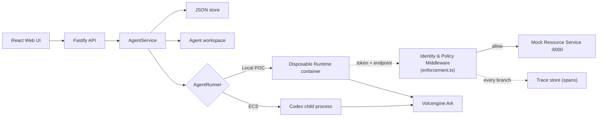

# Architecture

Volc Agent Launchpad is a single-node control plane for hackathon use. This
build adds a **Per-Agent Identity with Scoped Permissions** middleware
(the "Bouncer" track): every Agent gets its own token, scoped to only the
resources its owner granted, enforced at a single backend boundary the Agent
cannot bypass. See [docs/assets/architecture-diagram.png](assets/architecture-diagram.png)
for the annotated trust-boundary diagram.



## Components

### Web UI

Lists Agents, manages lifecycle actions, submits prompts, and polls asynchronous
Runs. It never receives the Ark API key. The Security panel (`CredentialsPanel`,
`TraceTimeline`) shows each Agent's live token and its correlated trace,
reading real backend data rather than a mock.

### Fastify API

Validates requests, protects remote demos with a shared bearer token, and
serves the compiled Web UI. The token is not user identity or authorization —
that is the job of the Identity & Policy Middleware below.

### Identity & Policy Middleware (`enforcement.ts`)

The trusted enforcement point for `POST /api/resource/fetch`. Every Agent
receives its own token (`tokenId` + a secret shown once, stored only as a
SHA-256 hash) scoped to `resource:read:<ownerId>`. On every fetch attempt the
middleware hashes the presented secret, looks up the token, and denies with a
specific reason — `unknown_token`, `revoked`, or `out_of_scope` — before ever
calling the mock resource service. Every branch writes exactly one trace span
carrying the `tokenId` only, never the secret or the response body. The Agent
runs entirely inside an untrusted container; the moment its request crosses
into the Fastify process, it is on the trusted side of the boundary.

### AgentService

Coordinates lifecycle state, persistence, workspaces, Runs, and the token
lifecycle (issue on creation, revoke, reissue, and cascade-revoke on
deletion). One Agent can have only one active Run.

```text
ready -> busy -> ready
  |       |
  v       v
stopped  error
```

Interrupted Runs become `cancelled` after a restart.

### Storage

```text
data/launchpad.json       Agent, message, and Run metadata
workspaces/AgentID/       Agent-created files
workspaces/.deleted/      Archived deleted workspaces
codex-home/               Codex configuration and sessions
```

`JsonStore` serializes writes and atomically replaces one JSON file. It supports
one process only.

### Runtime providers

- `CodexRunner` runs Codex inside the application container for ECS.
- `ContainerCodexRunner` starts one disposable Docker, Colima, or Podman
  container for every local turn.

Both providers use argv-only process execution, bound output and time, resume
the stored Codex thread, and escalate termination after a grace period.

## Deployment profiles

| Profile | Control plane | Agent execution |
| --- | --- | --- |
| Local POC | Host Node.js | Disposable local container |
| ECS | Application container | Codex process in the same container |
| Local development | Host Node.js | Host Codex process |

## Extension seams

| Track | Primary seam | Status |
| --- | --- | --- |
| Bouncer (identity and authorization) | `enforcement.ts`, `AgentToken`, `TraceSpan` | **Implemented** — see above. |
| Glass Box (trace and audit) | `AgentRunner`, `AgentRun`, `TraceSpan` | Partially covered: every resource fetch, token, and run-lifecycle event is a correlated span (`GET /api/runs/:id/trace`). Extending correlation into Codex's own reasoning/tool-call steps is a further seam, not attempted here. |
| Kill Switch (threat modeling and safety) | `AgentRunner` | Not attempted beyond the Starter Kit's default CPU/memory/PID/capability limits and the Bouncer's own containment of the prompt-injection abuse case. |

The current container or ECS instance is the POC trust boundary. Ordinary
containers are not hardened multi-tenant isolation.
